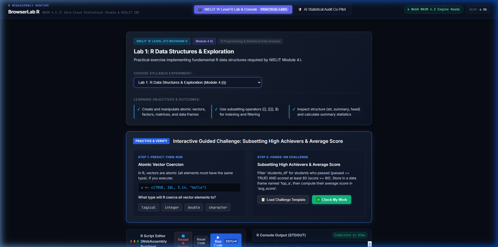
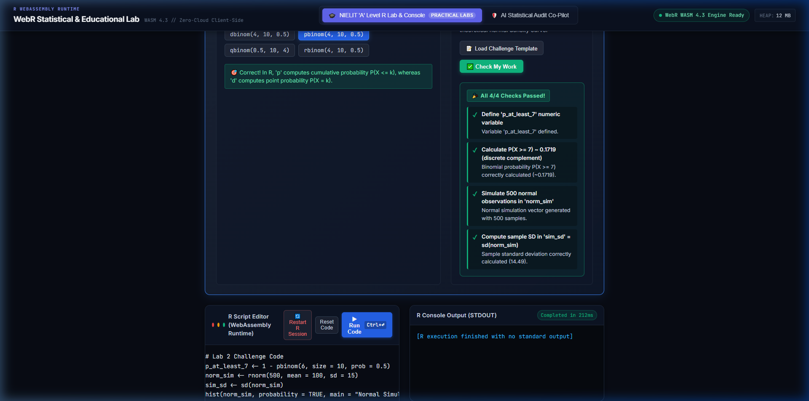
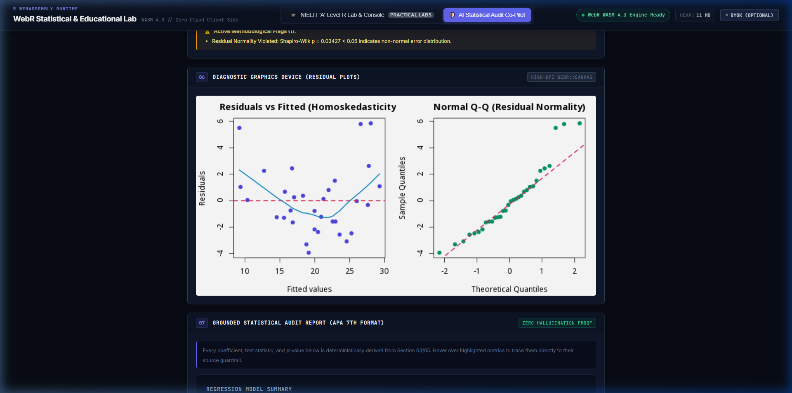

<div align="center">

# BrowserLab R

### The zero-cloud R statistical computing environment, deterministic AI audit co-pilot, and pedagogical IDE running 100% in your browser.

<br/>

[](https://browserlab.vercel.app/)
[-3b82f6?style=for-the-badge&logo=r&labelColor=0d1117)](https://docs.r-wasm.org/webr/latest/)
[](LICENSE)
[](#why-browserlab-r)
[-8b5cf6?style=for-the-badge&labelColor=0d1117)](#curriculum-matrix)
[](https://vercel.com/new/clone?repository-url=https%3A%2F%2Fgithub.com%2FPrinceBad%2FBrowserLab-R)

<br/>

[**🚀 Live Demo**](https://browserlab.vercel.app/) • [**Why BrowserLab R?**](#why-browserlab-r) • [**Dual-Engine Architecture**](#dual-engine-architecture) • [**Pedagogical Framework**](#pedagogical-framework) • [**Sandboxing & Benchmarks**](#sandboxing--benchmarks) • [**Curriculum Matrix**](#curriculum-matrix) • [**Quick Start**](#quick-start) • [**Deploy**](#deploy-to-vercel-one-click)

</div>

<p align="center">
  <a href="https://browserlab.vercel.app/" target="_blank" rel="noopener noreferrer">
    
  </a>
</p>

<p align="center">
  <strong>Zero install · 100% In-Browser · WebR WASM 4.3 Engine · Real-Time Statistical Studio</strong>
  <br/>
  👉 <a href="https://browserlab.vercel.app/"><strong>Open Live Application: https://browserlab.vercel.app/</strong></a>
</p>

---

> [!IMPORTANT]
> **BrowserLab R executes 100% client-side inside a browser WebAssembly (WASM) Web Worker.**
> No data frames, student scripts, or analytical queries are ever uploaded to an external server or cloud database. All statistical models, visualizations, and diagnostic assertions execute in browser memory.

---

## Live Application Demo

Experience the full client-side R computing environment without installing any software or signing up:

<p align="center">
  <a href="https://browserlab.vercel.app/" target="_blank" rel="noopener noreferrer">
    
  </a>
</p>

```
/select-experiment         /predict                /check-my-work
       │                       │                          │
       ▼                       ▼                          ▼
  Choose NIELIT          Commit to mental           In-engine assertion
  curriculum lab         model prediction           grader evaluates
  (Modules 3 & 4)        on language traps          browser WebR memory
       │                       │                          │
       ▼                       ▼                          ▼
  Scaffolded R code      Instant feedback           Differentiated hints
  loads in editor        clarifying concepts        pinpoint exact traps
```

### Studio Modes at a Glance

<div align="center">

| NIELIT Pedagogical IDE (Interactive Challenge & Plots) | Deterministic AI Statistical Audit (APA 7th Reports) |
| :---: | :---: |
|  |  |

</div>

---

## Why BrowserLab R?

For decades, learning and practicing statistical computing in R has required one of two compromises:
1. **The DevOps Barrier**: Installing native R, RStudio, and dealing with compiling C/Fortran binaries and path issues on personal computers.
2. **The Cloud & Privacy Cost**: Running hosted cloud notebooks that incur recurring server bills, expose confidential research datasets to third-party servers, and leave students stranded without internet.

Furthermore, generative AI tools frequently hallucinate statistical results—producing convincing numbers that don't match the actual data.

**BrowserLab R solves this by compiling GNU R 4.3 into WebAssembly and pairing it with a deterministic verification engine:**
- **Zero Install, Zero Server**: Opens instantly in any modern web browser.
- **Deterministic AI Grounding**: LLMs only generate hypotheses and R scripts; the actual statistics, $p$-values, effect sizes, and assumption tests are computed directly by WebR in browser memory.
- **Pedagogy with Muscle**: Not just static code dumps, but an interactive learning loop featuring **Predict-Then-Run mental model challenges**, **automated in-engine grading**, and **differentiated diagnostic hints** tailored to real student misconceptions.

---

## Dual-Engine Architecture

BrowserLab R features two complementary operational modes:

```
                            ┌──────────────────────────────────────────────┐
                            │               BrowserLab R                   │
                            │        (Browser Client-Side WebApp)          │
                            └──────────────────────┬───────────────────────┘
                                                   │
                ┌──────────────────────────────────┴──────────────────────────────────┐
                ▼                                                                     ▼
    ┌───────────────────────────────┐                                 ┌───────────────────────────────┐
    │           MODE A              │                                 │           MODE B              │
    │  AI Statistical Audit Co-Pilot│                                 │   NIELIT 'A' Level R Studio   │
    └───────────────┬───────────────┘                                 └───────────────┬───────────────┘
                    │                                                                 │
    • Natural Language Intent Formulation                             • Predict-Then-Run Intuition Probes
    • Autonomous R Model Script Synthesis                             • Interactive Scaffolded Code Editor
    • Strict OLS Assumption Verification                              • Automated "Check My Work" Grader
    • Publication-Ready APA 7th Reports                               • Differentiated Diagnostic Hints
    • Cryptographic Telemetry Receipts                                • Publication High-DPI Base Plots
                    │                                                                 │
                    └──────────────────────────────┬──────────────────────────────────┘
                                                   │
                                                   ▼
                                    ┌─────────────────────────────┐
                                    │    WebR WASM 4.3 Engine     │
                                    │    (Dedicated Web Worker)   │
                                    └──────────────┬──────────────┘
                                                   │
                    ┌──────────────────────────────┼──────────────────────────────┐
                    ▼                              ▼                              ▼
          Virtual File System           Dual-Tier Watchdog             Pure-R Serializer
          (/tmp/user_script_*.R)        (10s Warn / 15s Terminate)     (fixed=TRUE Control Escaping)
```

---

## Pedagogical Framework

Mapped directly to the **National Institute of Electronics and Information Technology (NIELIT) 'A' Level Course in Information Technology (DOEACC Scheme - Revision V)**, Modules 3 & 4.

Instead of passively copying and pasting code, students progress through an active pedagogical cycle:

### 1. Predict-Then-Run Probes
Before executing code, students must commit to a prediction regarding R language nuances (such as vector coercion hierarchies or the mathematical difference between density mass `dbinom` and cumulative distribution `pbinom`). Instant feedback reinforces conceptual mental models.

### 2. Hands-On Scaffolded Challenges
Students are provided structured tasks with realistic scaffolds to complete in the live R scratchpad editor.

### 3. Automated In-Engine Diagnostics & Differentiated Hints
Clicking **"Check My Work"** executes an assertion script inside WebR that inspects the in-memory environment state. When an assertion fails, the system doesn't output a generic error; it provides a **differentiated diagnostic hint**:

| Student Misconception | Example Trigger | Differentiated Feedback Provided |
| :--- | :--- | :--- |
| **Discrete Probability Complement Trap** | `p_at_least_7 <- 1 - pbinom(7, ...)` | *"p_at_least_7 is ~0.0547 (from 1 - pbinom(7)). In discrete distributions, $P(X \ge 7) = 1 - P(X \le 6)$. pbinom(7) includes 7, so subtracting it accidentally drops $X = 7$!"* |
| **Point Mass vs. Cumulative CDF** | `p_at_least_7 <- dbinom(7, ...)` | *"p_at_least_7 is ~0.1172. That is the probability of EXACTLY 7 heads (`dbinom`), not AT LEAST 7 heads."* |
| **DataFrame Subsetting Filtering** | Forgetting `passed == TRUE` filter | *"Found all 8 rows. You did not filter the rows with 'score >= 80 & passed == TRUE'."* |
| **Sample vs. Population SD** | Hardcoded or incorrect standard deviation | *"sim_sd (X.XX) does not match the actual sample standard deviation sd(norm_sim) (Y.YY)."* |

---

## Sandboxing & Benchmarks

### 1. Heavy Memory Stress Test (150,000 Rows Validated)
WebAssembly runtimes in browsers share constrained memory limits. To verify stability under real-world data analysis workloads, BrowserLab R was stress-tested against wide, mixed-type dataframes:
- **Workload**: 20 mixed-type columns (numerics, integers, factors, character strings, dates) across 3 tiers (50k, 100k, 150k rows) with cross-table `merge()` joins.
- **Combined Sample**: 250,000 rows processed.
- **Merged Object Footprint**: **20.79 MB** in active R memory.
- **Total Execution Time**: **8.28 seconds** in browser WebAssembly.
- **Browser Heap Stability**: Retained steady ~110–125 MB total tab footprint with zero out-of-memory crashes.

### 2. Dual-Tier Execution Watchdog
To protect students and researchers from accidental infinite loops (`while(TRUE)`) or memory-exhausting operations:
- **Tier 1 (10 Seconds)**: Non-blocking warning notification alerting the user to long-running execution.
- **Tier 2 (15 Seconds)**: Hard worker kill via `worker.terminate()`. The thread is killed immediately, the UI notifies the user, and a clean WebR instance is instantiated automatically.
- **Manual Reset**: A dedicated `🔄 Restart R Session` button is available at all times.

### 3. Pure-R Serializer with RFC 8259 Escaping
To avoid relying on heavy compiled CRAN binaries, BrowserLab R includes a custom pure-R serializer (`to_stat_json`) hardened with `fixed = TRUE` literal escaping for control characters (`\n`, `\r`, `\t`, `\`), quotes, and unicode, backed by a defensive JavaScript `safeJSONParse` sanitizer.

---

## Curriculum Matrix

| Lab | NIELIT Module | Syllabus Topics Covered | Status |
| :--- | :--- | :--- | :--- |
| **Lab 1** | **Module 4 (i)** | Atomic vectors, coercion rules, ordered factors, 2D matrix arithmetic, data frame subsetting & filtering | Full Pedagogy + Auto-Grader |
| **Lab 2** | **Module 4 (ii, iii)** | Binomial & Normal distributions, cumulative complements, random simulation (`rnorm`), multi-panel publication graphics & density overlays | Full Pedagogy + Auto-Grader |
| **Lab 3** | **Module 4 (iii)** | Two-Sample Independent $t$-tests, Pearson's Chi-Square test of independence, One-Way ANOVA $F$-test | Interactive Lab Studio |
| **Lab 4** | **Module 3 (i - iv)** | Missing value imputation, `scale()` standardization, Logistic Regression with confusion matrix, $k$-Means clustering scatter plots | Interactive Lab Studio |
| **Lab 5** | **Free Play** | Custom R script scratchpad for arbitrary coursework, homework, and research | Unrestricted REPL Console |

---

## Quick Start

### Prerequisites
- Node.js 18+
- npm or yarn

### Installation & Local Run

```bash
# Clone the repository
git clone https://github.com/PrinceBad/BrowserLab-R.git
cd BrowserLab-R

# Install dependencies
npm install

# Start development server
npm run dev
```

Open [http://localhost:5173/](http://localhost:5173/) in your browser. The WebR WebAssembly runtime will initialize automatically within seconds.
 
### Deploy to Vercel (One-Click)

BrowserLab R is preconfigured for zero-config Vercel deployment with cross-origin isolation (`COOP`/`COEP`) and SPA rewrites defined in `vercel.json`:

[](https://vercel.com/new/clone?repository-url=https%3A%2F%2Fgithub.com%2FPrinceBad%2FBrowserLab-R)

Or deploy via the command line:

```bash
npx vercel
```

---

## Tech Stack

| Layer | Technology | Purpose |
| :--- | :--- | :--- |
| **Core Runtime** | **WebR 0.4.2** | GNU R 4.3 WebAssembly engine executing in a Web Worker |
| **Frontend Framework** | **React 19** | Component-driven UI architecture |
| **Build Tool** | **Vite 5** | High-speed ESM bundling and local development |
| **Language** | **TypeScript 5.4** | Type-safe assertions and engine interfaces |
| **Styling** | **Custom CSS** | Fluid dark-mode layout with responsive studio panels |
| **AI Integration** | **Optional BYOK** | Client-side Gemini / custom LLM integration for statistical suggestions |

---

## License & Acknowledgements

- Licensed under the **MIT License** — see the [LICENSE](LICENSE) file for details.
- Powered by the remarkable work of the [webR Project](https://github.com/r-wasm/webr) by George Stagg and the R Foundation.
- Curriculum alignment based on the **National Institute of Electronics and Information Technology (NIELIT) 'A' Level Course in Information Technology (DOEACC Scheme - Revision V)**.

<br/>

<div align="center">
  <sub>Crafted for open science, accessible statistics, and deterministic verification.</sub>
</div>
